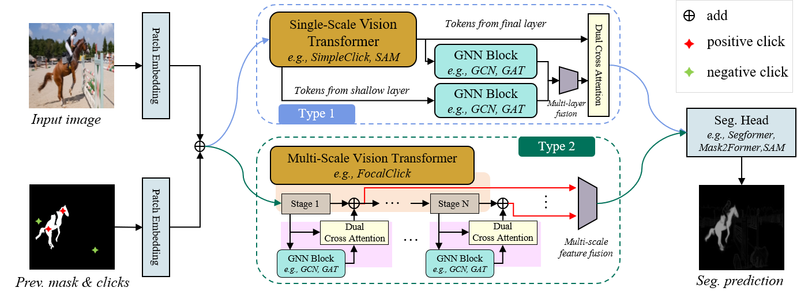
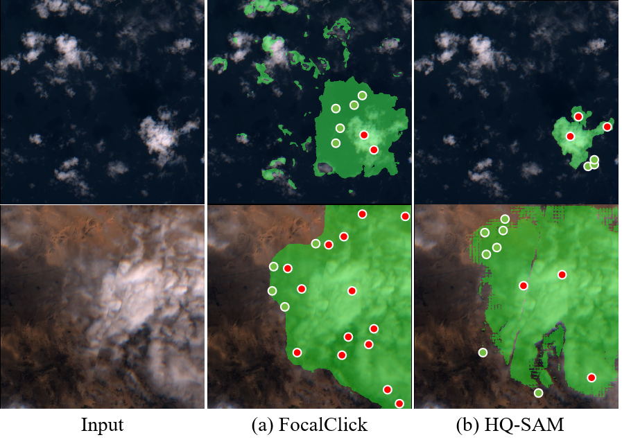

# Structured Click Control in Transformer-based Interactive Segmentation
[](https://arxiv.org/abs/2405.04009)

I've added the missing files. If there are any issues with the code, please let me know.

<p align="center">
  
</p>

## Motivation

Click-point-based interactive segmentation has received widespread attention because of its efficiency.
However, it is difficult for existing algorithms to obtain precise and robust responses after multiple clicks. In such cases, the segmentation results tend to show minimal improvement or even deterioration.
To enhance the robustness of the response, we propose a structured click intent model based on graph neural networks. This model adaptively identifies graph nodes via the global similarity of user-clicked Transformer tokens.
These nodes are then aggregated to obtain the structured interaction features.
Finally, the dual cross-attention mechanism is used to integrate structured interaction features into vision Transformer features, thereby enhancing the control of clicks over the segmentation results.
Extensive experiments have demonstrated that the proposed algorithm can serve as a general structure for improving Transformer-based interactive segmentation performance. 
<p align="center">
  
</p>

## Submission Record

[I will update the submission record here](SubmissionRecord.md)

## Environment
Training and evaluation environment: Python3.8.8, PyTorch 1.11.0, Ubuntu 20.4, CUDA 11.0. Run the following command to install required packages.
```
pip3 install -r requirements.txt
```
You can build a container with the configured environment using our [Dockerfiles](https://github.com/uncbiag/SimpleClick/tree/main/docker). 
Our Dockerfiles only support CUDA 11.0/11.4/11.6. If you use different CUDA drivers, you need to modify the base image in the Dockerfile (This is annoying that you need a matched image in Dockerfile for your CUDA driver, otherwise the gpu doesn't work in the container. Any better solutions?).
You also need to configue the paths to the datasets in [config.yml](https://github.com/uncbiag/SimpleClick/blob/main/config.yml) before training or testing.

## Demo
<p align="center">
  
</p>

An example script to run the demo.
```
python3 demo.py --checkpoint=./weights/scc_models/cocolvis_vit_base.pth --gpu 0
```

## Evaluation
Before evaluation, please download the datasets and models, and then configure the path in [config.yml](https://github.com/hahamyt/scc/blob/main/config.yml).

Use the following code to evaluate the huge model.
```
python scripts/evaluate_model.py NoBRS \
--gpu=0 \
--checkpoint=./weights/scc_models/cocolvis_vit_huge.pth \
--eval-mode=cvpr \
--datasets=GrabCut,Berkeley,DAVIS,PascalVOC,SBD,COCO_MVal,ssTEM,BraTS,OAIZIB
```

## Training
Before training, please download the [MAE](https://github.com/facebookresearch/mae) pretrained weights (click to download: [ViT-Base](https://dl.fbaipublicfiles.com/mae/pretrain/mae_pretrain_vit_base.pth), [ViT-Large](https://dl.fbaipublicfiles.com/mae/pretrain/mae_pretrain_vit_large.pth), [ViT-Huge](https://dl.fbaipublicfiles.com/mae/pretrain/mae_pretrain_vit_huge.pth)) and configure the dowloaded path in [config.yml](https://github.com/hahamyt/scc/blob/main/config.yml).

Use the following code to train a huge model on C+L: 
```
python train.py models/gnnvit/base448_cclvs_gat.py \
--batch-size=32 \
--ngpus=4
```

## Download 
SimpleClick models: ```Comming soon```

BraTS dataset (369 cases): [Google Drive](https://drive.google.com/drive/folders/1B6y1nNBnWU09EhxvjaTdp1XGjc1T6wUk?usp=sharing) 

OAI-ZIB dataset (150 cases): [Google Drive](https://drive.google.com/drive/folders/1B6y1nNBnWU09EhxvjaTdp1XGjc1T6wUk?usp=sharing)

Other datasets: [RITM Github](https://github.com/saic-vul/ritm_interactive_segmentation)

## Notes
[19/08/2024] Release the main models. This repository is still under active development.

## License
The code is released under the MIT License. It is a short, permissive software license. Basically, you can do whatever you want as long as you include the original copyright and license notice in any copy of the software/source. 

## Citation
```bibtex
@article{xu2024structured,
  title={Structured Click Control in Transformer-based Interactive Segmentation},
  author={Xu, Long and Chen, Yongquan and Huang, Rui and Wu, Feng and Lai, Shiwu},
  journal={arXiv preprint arXiv:2405.04009},
  year={2024}
}
```
## Acknowledgement
Our project is developed based on [RITM](https://github.com/saic-vul/ritm_interactive_segmentation). Thanks for the nice demo GUI :)
